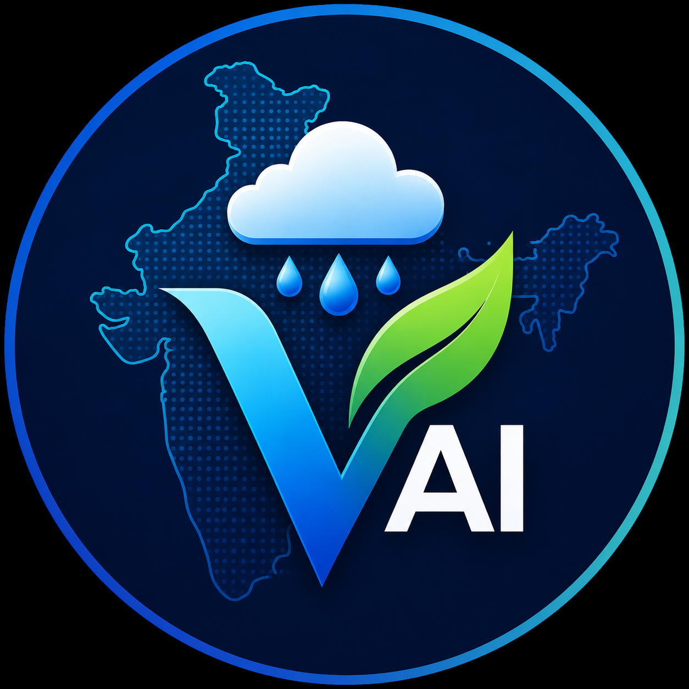

<div align="center">
  
  <h1>VarshaAI</h1>
  <p><strong>Predict Today. Simulate Tomorrow. Protect India.</strong></p>
  <p>An AI-powered Digital Twin of India's Climate, unifying live telemetry with XGBoost-based neural architectures to shield the subcontinent from extreme weather events.</p>
</div>

---

## 🌩️ About VarshaAI

VarshaAI is an enterprise-grade Climate Operating System designed to serve as a comprehensive command center for agricultural planning, disaster mitigation, and real-time weather analytics. It ingests massive amounts of meteorological data from satellites (e.g., ISRO INSAT-3D) and live telemetry, processes it through machine learning pipelines, and visualizes it using interactive 3D globes and geospatial maps.

### Core Features
- **Live Telemetry Dashboard:** Monitor real-time AQI, Temperature, and Rainfall metrics for any Indian state.
- **Interactive 3D Mapping:** Fluid 3D globe overlaid with satellite infrared data to track incoming weather vectors.
- **Scenario Simulator:** Dial up the global temperature anomaly to predict agricultural impacts across the subcontinent using live ML models.
- **AI Forecasting Engine:** High-performance XGBoost core that processes decadal climate models to issue flash flood and drought warnings.

---

## 🛠️ Tech Stack

VarshaAI is a full-stack monorepo consisting of a high-performance Python backend and a cutting-edge React frontend.

### Frontend
- **Framework:** Next.js 15+ (React 19)
- **Styling:** Tailwind CSS v4 with highly customized "Neo-Brutalist Climate OS" aesthetics.
- **Animations:** Framer Motion (Volumetric clouds, digital rain overlays, layout transitions).
- **3D & Geospatial:** Three.js (`@react-three/fiber`), MapLibre GL JS (`react-map-gl`).
- **State Management:** Zustand.

### Backend
- **Framework:** FastAPI
- **Database:** SQLAlchemy & Alembic (SQLite / PostgreSQL)
- **Machine Learning:** Scikit-Learn, XGBoost, Pandas, Numpy.
- **Data Ingestion:** Asynchronous pipeline designed for external meteorological APIs.

---

## 🚀 Getting Started

### Prerequisites
- Node.js (v18 or higher)
- Python (3.9 or higher)

### 1. Backend Setup (FastAPI)
Navigate to the backend directory and set up a virtual environment:
```bash
cd backend
python -m venv venv

# On Windows:
venv\Scripts\activate
# On macOS/Linux:
source venv/bin/activate

# Install dependencies
pip install -r requirements.txt

# Run the API server
uvicorn main:app --host 0.0.0.0 --port 8000 --reload
```
The API will be available at `http://localhost:8000`.

### 2. Frontend Setup (Next.js)
In a new terminal window, navigate to the frontend directory:
```bash
cd frontend

# Install dependencies
npm install

# Start the development server
npm run dev
```
The Climate OS will boot up at `http://localhost:3000`.

---

## 🌐 Deployment

VarshaAI is designed to be easily deployed to modern serverless platforms.

### 1. Deploy the Backend
We recommend deploying the FastAPI backend to [Railway](https://railway.app/) or [Render](https://render.com/).
- A `railway.toml` file is already included.
- Connect your GitHub repository to Railway, set the root directory to `backend`, and it will automatically deploy the FastAPI application using Uvicorn.
- **Important:** Note the public URL of your deployed backend (e.g., `https://varshaai-production.up.railway.app`).

### 2. Connect Backend to Frontend
Before deploying the frontend, tell it where the backend lives.
- In the `frontend` folder, create a `.env.production` file.
- Add your backend URL:
  ```env
  NEXT_PUBLIC_API_URL=https://varshaai-production.up.railway.app
  ```

### 3. Deploy the Frontend (Vercel)
The Next.js frontend is optimized for [Vercel](https://vercel.com/).
1. Go to your Vercel Dashboard and click **Add New... > Project**.
2. Import the VarshaAI repository from GitHub.
3. In the framework preset, ensure **Next.js** is selected.
4. Set the **Root Directory** to `frontend`.
5. Add your `NEXT_PUBLIC_API_URL` to the Environment Variables section.
6. Click **Deploy**.

---

## 👨‍💻 System Architect
**Ananya Rout**
- 🐙 [GitHub](https://github.com/CircuitFairy)
- 💼 [LinkedIn](https://www.linkedin.com/in/arout06/)
- ✉️ [ananyarout2006@gmail.com](mailto:ananyarout2006@gmail.com)

---
<div align="center">
  <sub>VarshaAI &copy; 2026. Predict Today. Simulate Tomorrow.</sub>
</div>
